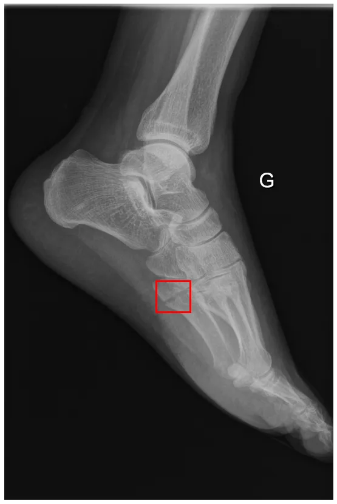
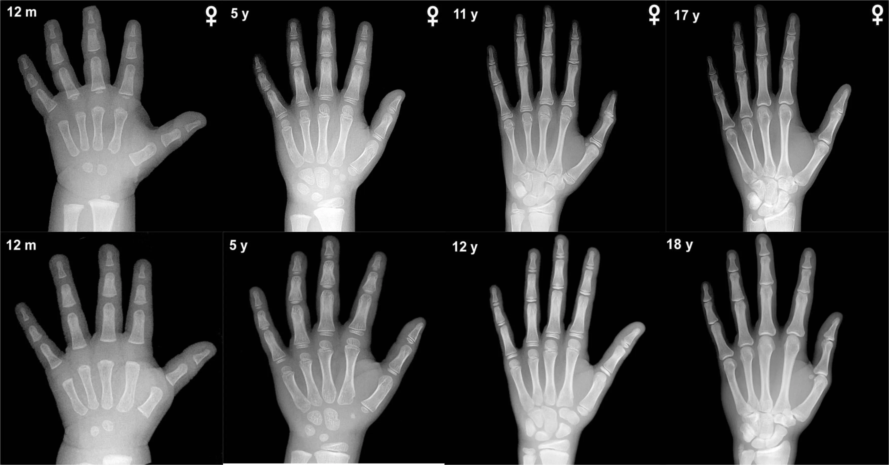
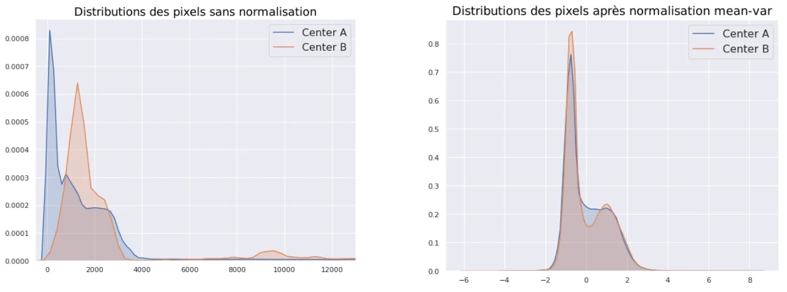
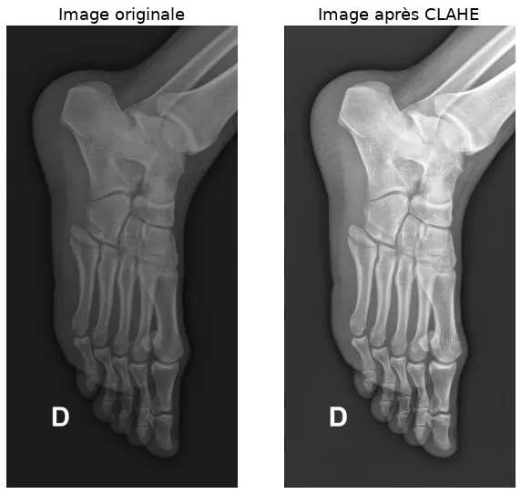
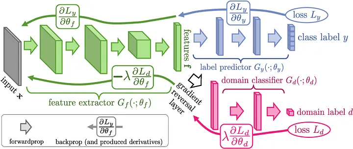

# Introduction

Today, it is universally acknowledged that deep learning algorithms are capable of achieving excellent performance in a familiar environment. For example, a self-driving car trained in New York will excel at detecting pedestrians on New York streets. But what would happen if we placed the same vehicle in Paris? Can we expect the same level of performance? The short answer is no.

Yet, aside from a few specificities, there is nothing that fundamentally differentiates a New Yorker from a Parisian — the task of pedestrian detection remains the same. However, we have made a significant environmental change. The architecture of the buildings, the road signage, and the layout of streets and sidewalks are very different in the two metropolises. These environmental changes disrupt the algorithm. One can observe a form of confusion that will be reflected in the model’s predictions.

This issue, known as _Domain Adaptation,_ is a current topic that is increasingly engaging the deep learning community.

## Domain Adaptation in Medical Imaging

Example of an annotated image (with label)

In radiology, we face this problem when we use our algorithms in medical centers different from those on which the training was performed. Over the past two years, we have developed at [AZmed](https://www.azmed.co/) a high-performing detection system capable of automatically locating bone fractures on standard radiographs. We started with a state-of-the-art algorithm that excelled at object detection on natural images (i.e., everyday images), and we transformed it to excel at fracture detection on radiographic images.

Our ambition has always been to develop a model that generalizes across all centers. We therefore encountered domain adaptation challenges very early on. This is a real challenge, as we will see later, because each medical center is unique and has its own specificities. Beyond being an exciting challenge for AZmed’s researchers, solving this issue is essential for several reasons. Naively, to get around this problem, one might consider developing a custom algorithm for each medical center using only their own images for training. However, algorithms require thousands of images to achieve the desired performance. This idea would involve a heavy data collection task, followed by an annotation phase involving thousands of images. Indeed, the images provided to the algorithm must be manually labeled beforehand to enable learning. This is a time-consuming task that requires the expertise of several radiologists. Each image in our training dataset must go through the hands of three radiologists: the first writes a medical report, the second annotates the radiograph by drawing a box around the fracture, and the third validates or rejects the annotation.

Thus, the idea of pooling the images from all our partner centers for algorithm training is more natural. Moreover, even for a center where the algorithm performs well, it is essential to have developed a model that is not sensitive to domain shifts (i.e., medical center changes). In fact, we should not view a medical center as a fixed environment or domain. Over time and for various reasons, the appearance of radiographs will change (e.g., acquisition machines are regularly replaced). Our production algorithms will therefore face images that are noticeably different from those on which they were trained. In scientific literature, the term _source domain_ refers to the original environment on which the model was trained, and _target domain_ refers to a distinct and unknown environment for the algorithm, on which we want to achieve good performance.

Now that we’ve introduced the context and challenges, let’s dive into the topic of domain adaptation itself.

> _Why can an algorithm’s performance vary from one medical center to another?_

At first glance, the idea may seem counterintuitive, because we’d like to think there’s no difference between a bone fracture diagnosed at the Pitié Salpêtrière (Paris) and the same fracture diagnosed at the Timone Hospital (Marseille). To answer this question, let’s first recall how humans and machines learn.

## Human vs. Machine Learning

A human has the ability to learn from a simple description, sometimes accompanied by a few examples. Our brain handles the extrapolation of the given description remarkably well — this can be seen as theoretical instruction. This ability allows us to apply what we've learned in any environment, even if it differs from where we may have observed a few practical cases. The human capacity for rapid understanding and our visual skills can also be explained through Darwinism. Unlike an algorithm that starts from scratch, human experience can be seen as a shared accumulation passed down through human evolution.

Machines, on the other hand, learn differently. Today, it is difficult to provide theoretical instruction to a machine. Imitation learning explores the possibility of teaching a machine how to behave based on demonstrations. However, this area of research is limited to scenarios where the machine must act, such as in the case of self-driving cars. But how do we demonstrate a task that is based on a concept? For example, how could a radiologist show a machine how to detect a fracture?

To learn such complex concepts, today’s machines learn only through practice and trial and error, which requires a large labeled dataset. Through this kind of training, machines can achieve excellent performance on both simple tasks (e.g., distinguishing a cat from a dog) and highly complex ones that would take humans years to master. Sometimes, machines even achieve impressive results in tasks that were previously considered impossible. For instance, a deep learning algorithm developed by Google was able to accurately predict a patient’s sex based solely on a retinal image (AUC: 0.97), while ophthalmologists have only a 50% chance of getting it right [1].

This makes it extremely interesting to analyze and try to understand how the model made its predictions, as we might discover new approaches not yet imagined by humans. While this may not be very exciting in the case of gender classification from a retinal image, it becomes much more meaningful when we talk about discovering new diagnostic or prognostic techniques. Letting the machine’s “imagination” run free to explore the field of possibilities is also a very appealing idea in the discovery of new drugs or vaccines.

But — because there is always a “but” — once taken out of its original environment, the machine can lose its bearings. Unlike humans, it can only rely on its practical training, and is therefore likely to make mistakes when confronted with unfamiliar situations.

## Specific Characteristics of Each Medical Center

Let’s return to our domain adaptation problem and now examine why, from one medical center to another, the algorithm encounters specific characteristics in the images. The first major reason is related to the machines used to take radiographic images. These acquisition systems come from different manufacturers, are configured differently, can generate various artifacts, and produce images of differing quality. In fact, radiology machines — which are becoming increasingly precise — use different levels of _color depth._ Unlike color images (_RGB_), which are typically encoded in 8-bit (256 possible values for the red, green, and blue channels), X-ray imaging produces black and white images generally encoded in 12, 14, or 16-bit. A pixel encoded in 16-bit can represent 2¹⁶ values, or 65,536 different shades.

The second source of variability in the images comes from how the images are taken. Indeed, methods can vary depending on the medical center. These differences may stem from the institution's guidelines or directly from the radiology technicians, who may not all operate in the same way. As a result, the appearance of the resulting image is clearly affected.

Reduced bone density

Finally, medical centers can have particularities specific to the types of trauma and pathologies seen in their patients. The most severe traumas will typically be observed in large hospitals, while smaller radiology clinics will more often encounter mild to moderate injuries. For example, femoral neck fractures, which require patient immobilization, are more frequently seen in hospitals. Thus, the algorithm will also encounter diversity in patient conditions depending on whether it's deployed in a public hospital, private hospital, or radiology clinic.

Moreover, a major difference lies in the diversity of the patients treated in terms of age. The amount of bone in the skeleton decreases over time, and this bone loss is particularly noticeable in the metaphyses of long bones — intermediate regions located between the diaphysis and the epiphyses. In radiographic images, these differences are visible in the bone density. Additionally, the appearance of the skeleton changes throughout childhood and adolescence.

[2] Compilation of hand radiographs from children of different ages (girls on top, boys on bottom)

All these characteristics affect the appearance of the images, resulting in a unique and center-specific average pixel distribution. Since the algorithm bases its predictions solely on these pixels, it can become confused when switching from one distribution to another.

In summary, the problem of domain adaptation in medical imaging stems from two main factors: the variability in the data, which is intrinsic to medical images, and the difficulty in obtaining enough data to represent this diversity.

# Solutions

Several solutions can be considered to address this issue and thus enable our algorithms to generalize across different medical centers. Let’s now explore them.

## 1. Image Processing

First, certain operations can be applied to images in order to standardize them. As we’ve mentioned, the pixel distribution is specific to each center. By _normalizing_ the images, we can attempt to bring these distributions closer together, which will make the task easier for the algorithm. Several types of normalization exist: _min-max_ scales pixel intensity between two fixed values (e.g., between 0 and 1), while _mean-variance_ adjusts pixel intensity so that the mean is 0 and the standard deviation is 1. This latter method is also known as _standardization_ or _Z-score normalization_.

Pixel distributions with and without normalization

CLAHE (contrast limited adaptive histogram equalization)

We also try to standardize the overall appearance of the images. Indeed, depending on the machines and their settings, the images may be more or less bright and contrasted. We use a preprocessing technique called _CLAHE (contrast limited adaptive histogram equalization)_ to enhance contrast.

In addition to these standardization techniques, we apply data augmentation techniques to increase the diversity of images seen by the algorithm. Random transformations allow us to mimic the differences the algorithm might encounter across various centers. These techniques involve transforming an original image by adding perturbations. These include geometric operations such as rotations, translations, and zooming, as well as modifications of image characteristics like brightness and contrast. We can also simulate different image qualities by degrading the image with added noise, artifacts, and blur.

Random transformations of an image

## 2. Composition of the Training Dataset

During the training phase, instead of training our algorithms on a specific center, we mix and pool images from all our partner centers. The goal is to introduce as much natural diversity as possible so that the models are not disrupted by future environmental changes. This diversity brings a natural regularization to the algorithm, helping to prevent overfitting.

Another training method involves sequentially training the algorithm on different centers, starting each new training with the algorithm previously trained. This is a technique called _Transfer Learning_ (see [A.I and Medical Imagery — A Much Needed Marriage](/azmed/ai-and-medical-imagery-a-much-needed-marriage-33bd4201a8ac)). This approach avoids restarting a full training session (i.e., with all images from our partner centers) before deploying the algorithm in a new center.

Today, every deployment in a new center is preceded by a training phase using images from that center, to maximize performance in production. Transfer learning can drastically reduce training time by specializing the algorithm for images from the new center. However, we observed that algorithms trained using this method generalize less effectively than those trained globally. Our hypothesis is that, over successive training sessions across different centers, the algorithm _"forgets"_ the characteristics learned from previous centers. In other words, these specific trainings overwrite what was previously learned.

## 3. Neural Network Architecture

In addition to changes in image preprocessing and training strategies, modifications to the convolutional neural network (CNN) architecture help make the algorithm less sensitive to domain changes. The _Batch Normalization_ technique [3] is commonly used in most neural architectures because it facilitates and speeds up the training of deep networks.

Another lesser-known advantage of this technique is its usefulness for domain adaptation. The method involves normalizing the activations in each layer of the network. Without normalization, a shift in the distribution of the input image will cause shifts in the subsequent layers of the network. With normalization, the layers are constrained to have the same mean and variance, thus limiting this effect. This phenomenon was named _internal covariate shift_ by the authors of the paper that introduced Batch Normalization.

Finally, other more complex methods allow the algorithm to adapt to a new environment using only raw images from that environment. With these techniques, no annotation is needed to indicate the presence of a fracture — the image alone is sufficient for adaptation to the new center (i.e., _domain_). This is a significant burden lifted, since annotation can only be done by an expert, such as a radiologist.

Among these techniques is _Domain-Adversarial Training of Neural Networks_ [4], a semi-supervised approach (i.e., using both labeled and unlabeled images). The idea is to introduce a discriminator into the network whose goal is to determine whether the image comes from center A or B. While the algorithm is being trained on center A (for which annotations are available), the network is simultaneously trained to fool the discriminator so it can no longer distinguish between the two centers. The goal is to force the network to create _features_ that are domain-invariant. This way, the algorithm should perform equally well on both center A and center B.

[4] Ganin, Yaroslav, et al. “Domain-adversarial training of neural networks.”

_CSD_ [5] is another semi-supervised approach. Here, the idea is to create a duplicate of each original image and apply a transformation to it. Alongside classic training with labeled images from center A, predictions are made on both the original and transformed versions. If the predictions differ, the algorithm is penalized for inconsistency. This simple process, called _consistency loss_, forces the algorithm to adapt to the new center B without needing annotations.

[5] Jeong, Jisoo, et al. “Consistency-based Semi-supervised Learning for Object Detection.”

A final interesting approach, named _CycleGAN_ [6], involves transforming the images from center B into the “style” of center A before making predictions. The idea is as follows: since the algorithm was trained on center A, it will perform better if new center images “look like” those from center A. The transformation is done using a generative model trained using the _GANs (Generative Adversarial Networks)_ method. This involves training two networks in opposition: a generator that creates new images, and a discriminator that tries to distinguish real images from generated ones. As they train against each other, both networks improve, making the generated images increasingly realistic.

The concept of _consistency_ is also used to ensure the generative model creates images close to the originals, to avoid information loss during the style transformation.

[6] Zhu, Jun-Yan, et al. “Unpaired image-to-image translation using cycle-consistent adversarial networks.”

# Conclusion

We have discussed several relevant techniques to address the domain adaptation challenge. Let us also recall that data is key to adapting to the diversity introduced by different medical centers. We witnessed this firsthand during our research at AZmed. Our first algorithm was developed using data from a single center. When we tested it on images from a different center, its performance dropped. Gradually, as we added more centers to our training dataset, the algorithm’s performance on previously unseen centers became increasingly stable—indicating improved generalization.

Today, we continue to collect images from our new partner centers, as retraining remains an effective way to fine-tune the algorithm and gain those last few points of performance. Thanks to this additional data and our research work, the algorithm is reaching a phase of maturity. Eventually, we may no longer need to include new training data, as the models will have been exposed to a representative diversity across most centers. However, collecting data from a new center will still be necessary so our R&D team can validate model performance before deployment.

This phase of maturity that the algorithm is currently reaching is a major milestone. The ability to generalize across all centers significantly reduces the time required for production deployment. This allows us to meet the growing demand to deploy our algorithm across multiple centers simultaneously.

> One of the keys to large-scale deployment is indeed domain adaptation.

# References

[1] [Poplin, Ryan, et al. “Prediction of cardiovascular risk factors from
retinal fundus photographs via deep learning.” Nature Biomedical Engineering
2.3 (2018): 158.](https://research.google/pubs/pub46425/)

[2] <https://belendo.be/fr/croissance-et-puberte/groei-na-de-geboorte/>

[3] [Ioffe, Sergey, and Christian Szegedy. “Batch normalization: Accelerating
deep network training by reducing internal covariate shift.” arXiv preprint
arXiv:1502.03167 (2015).](https://arxiv.org/abs/1502.03167)

[4] [Ganin, Yaroslav, et al. “Domain-adversarial training of neural networks.”
The Journal of Machine Learning Research 17.1 (2016):
2096–2030.](https://arxiv.org/abs/1505.07818)

[5] [Jeong, Jisoo, et al. “Consistency-based Semi-supervised Learning for
Object detection.” Advances in Neural Information Processing Systems.
2019.](https://papers.nips.cc/paper/9259-consistency-based-semi-supervised-
learning-for-object-detection)

[6] [Zhu, Jun-Yan, et al. “Unpaired image-to-image translation using cycle-
consistent adversarial networks.” Proceedings of the IEEE international
conference on computer vision. 2017.](https://arxiv.org/abs/1703.10593)
